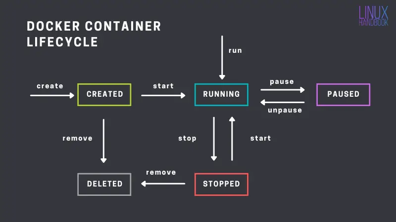

# 🧪 Docker Lab 1: Fundamentos y Primeros Contenedores

## 🎯 Objetivo del laboratorio

Familiarizarse con los conceptos esenciales de Docker, su instalación en Windows y la ejecución de contenedores básicos a través de comandos fundamentales.

> **Nota:** Este laboratorio está diseñado para desarrolladores que utilizan Windows y trabajan principalmente con .NET y C#. Se ha priorizado el uso de imágenes que no dependan de conocimientos previos en otros lenguajes como Python o Node.js.

---

## 🧰 Requisitos previos

* Tener permisos de administrador en el equipo
* Conexión a internet

---

## ⚙️ Paso 0: Instalación de WSL (Windows Subsystem for Linux)

Docker Desktop requiere que el subsistema de Linux esté habilitado en Windows para funcionar correctamente. Asegúrate de tener habilitado WSL2:

1. Abre PowerShell como administrador.
2. Ejecuta:

```powershell
wsl --install
```

3. Reinicia el equipo cuando se solicite.

> 📝 Puedes verificar la instalación ejecutando `wsl --status` en PowerShell.

---

## 🛠️ Paso 1: Instalación de Docker en Windows

### Opción recomendada: Docker Desktop

1. Descargar Docker Desktop desde el sitio oficial: [https://www.docker.com/products/docker-desktop/](https://www.docker.com/products/docker-desktop/)
2. Ejecutar el instalador y seguir los pasos del asistente.
3. Reiniciar el equipo si es solicitado.
4. Verificar que Docker esté corriendo (icono en la bandeja del sistema).

> 📝 Docker Desktop requiere que la virtualización esté habilitada en la BIOS y tener WSL2 activado.

---

## 🧪 Paso 2: Verificación de la instalación

```bash
# Verifica la versión instalada de Docker
> docker version
```

> Muestra las versiones del cliente (CLI) y del servidor (Docker Engine).

```bash
# Muestra información detallada del entorno Docker
> docker info
```

> Proporciona detalles como cantidad de contenedores, redes, volúmenes, sistema operativo, almacenamiento y más.

---

## 🐳 Paso 3: Ejecutar tu primer contenedor

### 1. `hello-world`

```bash
> docker run hello-world
```

> Este comando descarga una imagen mínima llamada `hello-world` desde Docker Hub (si no está presente localmente), crea un contenedor y lo ejecuta. Si todo funciona correctamente, se mostrará un mensaje de bienvenida.

### ¿Qué es una imagen en Docker?

> Una imagen en Docker es una plantilla de solo lectura que contiene todo lo necesario para ejecutar una aplicación: el sistema de archivos, dependencias, código fuente, variables de entorno, y más. Es como una instantánea que Docker puede usar para crear contenedores.

### 2. Contenedor interactivo con Alpine

```bash
> docker run -it alpine sh
```

* `-it` permite que el contenedor sea interactivo (como una terminal).
* `alpine` es una imagen muy liviana basada en Linux.
* `sh` inicia un shell.

Una vez dentro, prueba:

```bash
# Mostrar contenido del directorio
ls

# Mostrar nombre del sistema
uname -a

# Salir del contenedor
exit
```

---

## 📦 Paso 4: Manejo de imágenes y contenedores

### Comandos básicos explicados

```bash
# Ver todas las imágenes locales
> docker images
```

> Muestra las imágenes disponibles localmente, junto con su nombre, tag, ID y tamaño. Útil para saber qué imágenes ya tienes descargadas.

```bash
# Eliminar una imagen (si no está en uso)
> docker rmi <image_id>
```

> `rmi` significa "remove image". Permite eliminar imágenes que ya no se usan. No puedes eliminar una imagen si hay contenedores basados en ella.

```bash
# Ver contenedores en ejecución
> docker ps
```

> Lista únicamente los contenedores activos (en ejecución).

```bash
# Ver todos los contenedores (incluidos detenidos)
> docker ps -a
```

> Muestra todos los contenedores, estén o no activos. Muy útil para hacer limpieza o seguimiento.

```bash
# Detener un contenedor
> docker stop <container_id>
```

> Envía una señal de apagado al contenedor para detenerlo de forma segura.

```bash
# Eliminar un contenedor detenido
> docker rm <container_id>
```

> Elimina el contenedor de tu sistema. No elimina la imagen asociada.

````

### Probar otra imagen útil: .NET SDK
```bash
> docker run -it mcr.microsoft.com/dotnet/sdk:7.0 bash
````

> Esta imagen contiene el SDK completo de .NET 7. Dentro del contenedor, puedes ejecutar `dotnet --version` para verificar la instalación.

---

## 🗃️ Paso 5: Uso básico de volúmenes efímeros

```bash
# Crear un contenedor con un volumen temporal
> docker run -it -v /data alpine sh
```

> Este comando monta un volumen temporal en la ruta `/data`. Lo que escribas ahí estará disponible mientras el contenedor esté vivo.

```bash
# Dentro del contenedor
> echo "Hola desde Docker" > /data/mensaje.txt
```

> ⚠️ Si no nombras el volumen, se elimina automáticamente al borrar el contenedor.

---

## 🧠 Preguntas para reflexión

* ¿Qué diferencia hay entre una imagen y un contenedor?
* ¿Qué sucede cuando eliminas un contenedor pero no la imagen?
* ¿Por qué es útil el modo interactivo (`-it`)?
* ¿Cuál es el propósito de `docker ps` vs `docker ps -a`?
* ¿Por qué es importante entender el ciclo de vida de las imágenes y contenedores?

---

## Ciclo de vida de los contenedores en docker




📦 Entregable esperado

Para este laboratorio se espera como entregable una evidencia del proceso completo realizado por cada ingeniero. Esto incluye una serie de pantallazos del paso a paso que muestren:

Instalación de Docker Desktop en Windows

Verificación de la instalación con docker version y docker info

Ejecución del contenedor hello-world

Ejecución interactiva con alpine o ubuntu

Comandos usados: docker run, docker ps, docker images, docker stop, docker rm, docker rmi

Evidencia de prueba con imagen de .NET SDK

📁 Estructura sugerida del entregable

lab1/
├── capturas/
│   ├── 01-instalacion-docker.png
│   ├── 02-docker-version.png
│   ├── 03-run-hello-world.png
│   ├── 04-alpine-interactivo.png
│   └── ...
└── README.md (opcional, para describir brevemente el proceso)

🌿 Rama en Git

La entrega debe hacerse en una rama con la siguiente nomenclatura:

lab1_nombre_apellido

Por ejemplo:

lab1_santiago_suarez

📌 Asegúrate de subir las capturas ordenadas y descriptivas para facilitar su revisión.


## ✅ Cierre del laboratorio

Al terminar este laboratorio, deberías sentirte cómodo ejecutando contenedores básicos, explorando su contenido, gestionando imágenes y contenedores, y comprendiendo cómo Docker abstrae el sistema operativo para ejecutar aplicaciones de forma aislada.

En el próximo laboratorio comenzaremos a crear nuestras propias imágenes a partir de Dockerfiles sencillos.
